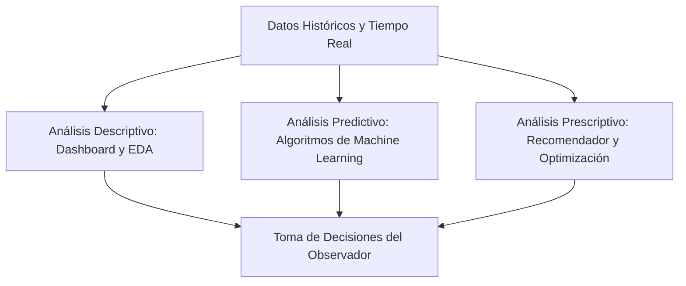
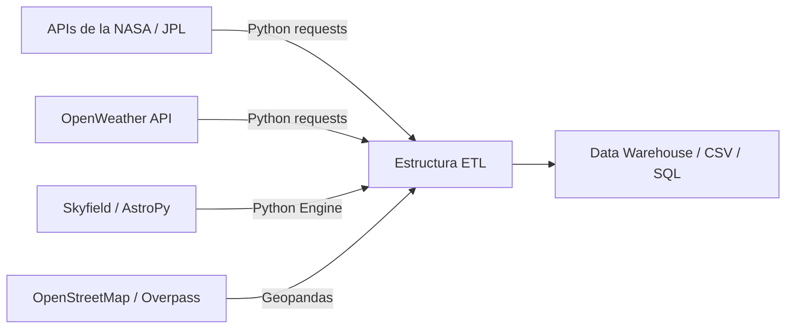

# Proyecto Stellarium: Solución de Machine Learning para la Observación de Múltiples Planetas Visibles en el Firmamento

**Autor:** Feibert Guzmán  
**Programa:** Ciencia de Datos e Inteligencia Artificial - Talento Tech  
**Metodología:** CRISP-ML  
**Fecha:** Mayo 2026  

---

## Paso 1: Construcción y contextualización del problema

La observación del firmamento nocturno ha sido una de las actividades científicas y culturales más antiguas de la humanidad, sirviendo como base para la navegación, la agricultura y la comprensión del cosmos. Sin embargo, en el contexto contemporáneo, realizar observaciones astronómicas de alta calidad se ha convertido en un desafío multidimensional, especialmente para los astrónomos aficionados y entusiastas de las constelaciones que cuentan con telescopios básicos de nivel principiante. 

El núcleo del problema radica en la dificultad técnica para identificar con precisión momentos óptimos en los que coinciden múltiples condiciones favorables que permitan visualizar eventos astronómicos singulares, específicamente escenarios donde se presenten **múltiples planetas visibles en el firmamento** alineados o concentrados en una misma región celeste, o bien en conjunción con la Luna.

Para comprender a fondo esta problemática, es necesario desglosar los factores críticos que limitan la práctica de la astronomía amateur:

1. **Importancia de la observación astronómica:** Fomenta la educación científica (STEM), estimula la curiosidad intelectual y el pensamiento crítico, y genera una mayor conciencia sobre la necesidad de preservar el patrimonio natural del cielo nocturno.
2. **Contaminación Lumínica:** La expansión urbana descontrolada ha inundado la atmósfera terrestre de luz artificial. El uso ineficiente del alumbrado público genera el "brillo celeste artificial" (*skyglow*), medido cuantitativamente bajo la escala de Bortle (donde 1 representa cielos prístinos de oscuridad total y 9 indica cielos altamente contaminados de centros urbanos). La dispersión de la luz reduce drásticamente el contraste del fondo del cielo, impidiendo que el ojo humano o los sensores ópticos de telescopios principiantes distingan planetas de baja magnitud visual (como Mercurio, Urano o Neptuno) o detalles sutiles de gigantes gaseosos como Júpiter y Saturno.
3. **Condiciones Climáticas Dinámicas:** La observación requiere cielos despejados. Variables meteorológicas como la cobertura de nubes (nubosidad en octas), la humedad relativa alta (que causa condensación en las ópticas y dispersión de la luz), el viento turbulento (que arruina el *seeing* o estabilidad atmosférica) y la presión del aire afectan críticamente la calidad visual.
4. **Dificultad en la Identificación de Momentos Ideales:** Los movimientos orbitales heliocéntricos de los planetas significan que sus posiciones relativas en la bóveda celeste cambian constantemente. Calcular cuándo coinciden planetas visibles al mismo tiempo sobre el horizonte local requiere el análisis simultáneo de datos de efemérides complejas que un observador principiante difícilmente puede procesar de manera intuitiva.
5. **Necesidad de Anticipar Eventos:** A diferencia de eventos programados como las lluvias de meteoros, las conjunciones planetarias y alineaciones óptimas ocurren en ventanas de tiempo muy estrechas. Sin una planeación predictiva y prescriptiva, el aficionado pierde oportunidades que pueden no repetirse en años.
6. **Limitaciones de Equipamiento Básico:** Los telescopios para principiantes (típicamente reflectores o refractores con aperturas menores a 114 mm y monturas altazimutales no motorizadas) carecen de sistemas informáticos de localización automatizada (*GoTo*). Por lo tanto, dependen enteramente de que las condiciones de visibilidad sean perfectas para poder enfocar y rastrear los objetos de forma manual.

**El rol de las zonas de baja contaminación lumínica:**  
Para mitigar la contaminación lumínica, los aficionados deben desplazarse hacia sitios reconocidos internacionalmente por su calidad de cielo. En Colombia, el referente principal es el **Desierto de la Tatacoa** (departamento del Huila), catalogado como un destino con certificación Starlight debido a su baja humedad, nula interferencia lumínica urbana y excelente visibilidad atmosférica gracias a su geografía semiárida. Otras zonas incluyen el Desierto de la Guajira o el altiplano de Villa de Leyva. La solución basada en datos debe prescribir de forma exacta cuándo y a cuál de estos puntos específicos debe trasladarse el usuario para garantizar que verá **múltiples planetas visibles en el firmamento**.

---

## Paso 2: Descripción de la solución basada en Inteligencia Artificial

Para resolver el problema multidimensional descrito, se propone una solución tecnológica integral basada en Ciencia de Datos e Inteligencia Artificial que implementa los tres pilares del análisis analítico:



1. **Análisis Descriptivo (¿Qué está pasando?):**  
   Consiste en la recolección, procesamiento y visualización de datos históricos astronómicos y meteorológicos. A través de un dashboard interactivo, el sistema muestra el estado actual de la atmósfera (nubosidad, humedad, estabilidad) y la posición geocéntrica de los cuerpos celestes en tiempo real. Esto permite al usuario comprender el comportamiento histórico del clima en diferentes puntos geográficos del país.
   
2. **Análisis Predictivo (¿Qué pasará?):**  
   Modelos de aprendizaje supervisado (como Random Forest o XGBoost) entrenados con variables climáticas, fases lunares e índices de visibilidad predicen la probabilidad cualitativa y cuantitativa de que el cielo esté lo suficientemente despejado en una coordenada específica. Paralelamente, algoritmos de cálculo orbital predicen con precisión matemática la presencia simultánea de **múltiples planetas visibles en el firmamento** (Mercurio, Venus, Marte, Júpiter y Saturno) por encima del horizonte local a una altitud angular mínima de 10° durante las horas de oscuridad (crepúsculo astronómico).
   
3. **Análisis Prescriptivo (¿Qué debemos hacer?):**  
   Un sistema de recomendación inteligente combina las predicciones meteorológicas y los cálculos astronómicos para prescribir al aficionado el curso de acción óptimo. El algoritmo optimiza variables múltiples para responder a las siguientes preguntas:
   * **El mejor día:** Aquel que maximice la cantidad de planetas simultáneamente visibles y minimice la cobertura nubosa y el brillo de la Luna (fase de Luna Nueva o Creciente/Menguante tardía).
   * **El mejor horario:** La ventana exacta de minutos posterior al crepúsculo vespertino o anterior al matutino donde la refracción atmosférica es mínima y los planetas alcanzan su mayor altitud angular.
   * **La mejor ubicación:** Coordenadas específicas recomendadas (ej. Desierto de la Tatacoa vs. coordenadas del usuario) evaluando la distancia de viaje frente a la ganancia en la escala de Bortle y la probabilidad de nubosidad.
   * **El mejor momento del año:** Identificar épocas específicas de oposiciones planetarias (cuando la Tierra está alineada directamente entre el Sol y un planeta externo, haciéndolo brillar con máxima intensidad) para capturar escenarios extraordinarios de **múltiples planetas visibles en el firmamento**.

---

## Paso 3: Definición de variables del proyecto

A continuación, se detalla la estructura de datos que alimentará los modelos de análisis y predicción. La **Variable Objetivo** representa el índice de calidad de observación de la bóveda celeste.

| Variable | Tipo de Variable | Tipo de Dato | Descripción | Uso dentro del Modelo |
| :--- | :--- | :--- | :--- | :--- |
| **Calidad_Observacion** (Objetivo) | Dependiente / Target | Numérico (Float [0-100]) o Binario (0/1) | Índice sintético de la visibilidad y nitidez general del cielo nocturno. | Variable a predecir por el modelo supervisado para clasificar la viabilidad de la sesión de observación. |
| **Nubosidad** | Independiente | Numérico (Integer [0-8 octas] o %) | Porcentaje de cielo cubierto por nubes en la coordenada y hora de interés. | Variable predictora crítica. Valores altos (>30%) penalizan directamente la calidad. |
| **Temperatura** | Independiente | Numérico (Float en °C) | Temperatura del aire en la superficie. | Controla el punto de rocío y previene la predicción de empañamiento de lentes ópticas. |
| **Humedad** | Independiente | Numérico (Float [0-100%]) | Porcentaje de humedad relativa del aire. | Humedades >85% dispersan fuertemente la luz y causan condensación. |
| **Presión Atmosférica** | Independiente | Numérico (Float en hPa) | Presión barométrica al nivel del suelo. | Indicador indirecto de estabilidad atmosférica (sistemas de alta presión favorecen cielos despejados). |
| **Velocidad Viento** | Independiente | Numérico (Float en m/s) | Velocidad de las corrientes de aire. | Afecta la estabilidad física del telescopio y la turbulencia del aire (*seeing*). |
| **Índice UV** | Independiente | Numérico (Integer [0-11+]) | Intensidad de la radiación ultravioleta diurna. | Variable indirecta para modelos meteorológicos de estabilidad de la masa de aire. |
| **Fase Lunar** | Independiente | Numérico (Float [0-1]) | Fracción iluminada del disco lunar (0=Nueva, 1=Llena). | A mayor iluminación lunar, mayor brillo natural en el cielo, afectando negativamente el contraste planetario. |
| **Posición Astronómica**| Independiente | Texto / Lista de Coordenadas | Coordenadas celestes (Ascensión Recta y Declinación) de los planetas. | Determina si los planetas están sobre el horizonte en la zona visible del observador. |
| **Altitud** | Independiente | Numérico (Float en metros) | Altura sobre el nivel del mar del punto de observación. | A mayor altitud, menor espesor de la capa atmosférica y mejor transparencia óptica. |
| **Contaminación Lumínica**| Independiente | Numérico (Bortle [1-9]) | Escala cuantitativa de brillo artificial del cielo nocturno. | Peso fundamental en el modelo prescriptivo para la selección del lugar de observación. |
| **Latitud** | Independiente | Numérico (Float [-90 a 90]) | Coordenada geográfica norte-sur. | Define la perspectiva geométrica del cielo local visible. |
| **Longitud** | Independiente | Numérico (Float [-180 a 180])| Coordenada geográfica este-oeste. | Permite el ajuste horario y la alineación con zonas horarias astronómicas. |
| **Visibilidad Atmosférica**| Independiente | Numérico (Float en km) | Distancia máxima a la que se puede identificar un objeto prominente. | Parámetro directo de la transparencia de las capas de aire bajas. |
| **Condiciones Climáticas**| Independiente | Categórico | Estado general del clima (Lluvia, Despejado, Tormenta, Niebla). | Filtro inicial categórico para descartar días inviables. |
| **Distancia a Ciudades** | Independiente | Numérico (Float en km) | Distancia geodésica al centro urbano más cercano con >50,000 hab. | Proxy secundario para estimar la dispersión lumínica en la dirección del horizonte. |
| **Datos Satelitales** | Independiente | Imagen / Raster o Numérico | Índice de reflectividad o espesor óptico de aerosoles medido por satélite. | Utilizado para estimar la densidad de polvo y partículas en la alta atmósfera. |
| **Planetas Visibles** | Independiente | Numérico (Integer [0-8]) | Conteo instantáneo de planetas con altitud angular >10° y magnitud aparente visible a ojo/telescopio. | Variable clave para validar el escenario de **múltiples planetas visibles en el firmamento**. |
| **Rotación Terrestre** | Independiente | Numérico (Float en sidéreo) | Tiempo sidéreo local que rige el paso de los planetas por el meridiano. | Sincronización temporal matemática de la observación. |
| **Histórico Meteorológico**| Independiente | Time Series (DataFrame) | Registro temporal de variables de clima de los últimos 10 años. | Permite identificar patrones estacionales estables de nubosidad por región. |

---

## Paso 4: Fuentes de datos y APIs

El ecosistema de datos astronómicos y climáticos se integrará mediante Python consumiendo múltiples APIs de acceso abierto y librerías científicas de alta precisión.



### 1. APIs Meteorológicas: OpenWeather API & Visual Crossing
* **Datos que aporta:** Cobertura de nubes en tiempo real, predicciones horarias a 7 días de temperatura, humedad, presión, velocidad del viento, punto de rocío y visibilidad atmosférica.
* **Integración en Python:**
  ```python
  import requests

  def get_weather_forecast(lat, lon, api_key):
      url = f"https://api.openweathermap.org/data/2.5/forecast?lat={lat}&lon={lon}&appid={api_key}&units=metric"
      response = requests.get(url).json()
      forecast_list = []
      for item in response['list']:
          forecast_list.append({
              'timestamp': item['dt'],
              'temp': item['main']['temp'],
              'humidity': item['main']['humidity'],
              'clouds': item['clouds']['all'],
              'wind_speed': item['wind']['speed'],
              'weather_desc': item['weather'][0]['description']
          })
      return forecast_list
  ```

### 2. APIs y Motores Astronómicos: Skyfield & AstroPy (Efemérides del JPL de la NASA)
* **Datos que aporta:** Posiciones tridimensionales de alta precisión de los planetas, la Luna y el Sol. Permite calcular coordenadas de altitud y azimut (AltAz) locales respecto al horizonte del observador, fases lunares y momentos de orto y ocaso.
* **Integración en Python:**
  ```python
  from skyfield.api import Topos, load

  def calculate_planetary_positions(lat, lon, datetime_utc):
      ts = load.timescale()
      eph = load('de421.bsp')  # Efemérides de alta precisión del JPL
      earth, planets = eph['earth'], {
          'mercury': eph['mercury'], 'venus': eph['venus'],
          'mars': eph['mars'], 'jupiter': eph['jupiter_barycenter'],
          'saturn': eph['saturn_barycenter']
      }
      
      observer = earth + Topos(latitude_degrees=lat, longitude_degrees=lon)
      time_obj = ts.from_datetime(datetime_utc)
      
      visible_planets = {}
      for name, body in planets.items():
          astrometric = observer.at(time_obj).observe(body)
          alt, az, distance = astrometric.apparent().altaz()
          visible_planets[name] = {
              'altitude': alt.degrees,
              'azimuth': az.degrees,
              'visible': alt.degrees > 10.0  # Visible por encima del horizonte mínimo
          }
      return visible_planets
  ```

### 3. Datos Geoespaciales y Satelitales: Google Earth Engine & OpenStreetMap
* **Datos que aporta:**
  * **Google Earth Engine (GEE):** Mapas históricos de reflectancia de nubes terrestres de satélites como GOES-16 o MODIS, y mapas de brillo nocturno de satélites DMSP/VIIRS para estimar el mapa de contaminación lumínica (Escala Bortle) en cualquier coordenada de Colombia.
  * **OpenStreetMap (OSM) / Google Maps API:** Rutas óptimas para transporte terrestre desde centros urbanos hasta zonas de observación y georreferenciación de observatorios locales.
* **Integración en Python:**
  ```python
  # Integración teórica mediante ee (Earth Engine Python API)
  import ee
  # ee.Initialize()
  # viirs = ee.ImageCollection("NOAA/VIIRS/DNB/MONTHLY_V1/VCMSLCFG").filterDate('2025-01-01', '2025-12-31').median()
  ```

---

## Paso 5: Construcción de la arquitectura de datos

Para garantizar la estabilidad y consistencia de los datos, diseñamos un flujo de procesamiento basado en una arquitectura ETL (Extracción, Transformación y Carga) automatizada en Python.

```
[ Extracción ] ---> [ Transformación (Pandas/NumPy) ] ---> [ Carga / Almacenamiento ]
  - API Weather        - Imputación de nulos (K-NN Imputer)     - Base de Datos SQL (PostgreSQL)
  - Skyfield Engine    - Normalización (MinMaxScaler)           - Serialización del Modelo (Joblib)
  - VIIRS Satélite     - Detección de atípicos (IsolationForest)- Data Lakehouse (Archivos Parquet)
```

1. **Recolección (Extracción):**
   * Automatización mediante scripts de cron en servidores locales o workflows de GitHub Actions que consultan las APIs meteorológicas cada 3 horas.
   * Generación programática de las posiciones planetarias históricas de los últimos 5 años usando `Skyfield`.

2. **Procesamiento de Datos (Transformación):**
   * **Limpieza:** Eliminación de duplicados temporales y validación de rangos lógicos (ej. humedad entre 0% y 100%, nubosidad entre 0 y 100%).
   * **Imputación de nulos:** Para registros climáticos faltantes, se utiliza la imputación por vecinos más cercanos (K-NN Imputer) basada en registros geográficos adyacentes.
   * **Normalización:** Escalado lineal de variables numéricas como presión, temperatura y velocidad del viento utilizando `MinMaxScaler` de Scikit-Learn para modelos sensibles a la escala (como SVM o KNN).
   * **Codificación:** Transformación de variables categóricas climáticas (ej. "Despejado", "Llovizna") usando codificación *One-Hot*.
   * **Detección de valores atípicos:** Aplicación del algoritmo *Isolation Forest* para identificar anomalías o errores instrumentales en los reportes de las estaciones climáticas.

3. **Carga y Almacenamiento:**
   * **Base de datos transaccional (SQL/PostgreSQL):** Almacena las predicciones meteorológicas activas, las coordenadas geográficas de los usuarios y las configuraciones de telescopios.
   * **Base de datos documental (MongoDB):** Ideal para almacenar el histórico no estructurado de los reportes meteorológicos y los comentarios del foro de aficionados.
   * **Archivos optimizados (Parquet / Data Warehouse):** Almacenamiento columnar eficiente para grandes volúmenes de series temporales astronómicas históricas utilizadas para el reentrenamiento anual de los modelos.

---

## Paso 6: Análisis Exploratorio de Datos (EDA)

El análisis exploratorio de datos es fundamental para comprender las dinámicas atmosféricas antes del modelado. En nuestro pipeline, el EDA se estructura de la siguiente manera:

* **Estadística descriptiva:** Análisis de la media, desviación estándar, medianas y cuartiles de variables como cobertura nubosa y humedad en zonas clave.
* **Histogramas de distribución:** Permiten observar cómo se distribuye la nubosidad en el Desierto de la Tatacoa a lo largo del año. Descubrimos una distribución bimodal: picos en 0% (cielo despejado de verano) y 100% (invierno nublado).
* **Análisis de correlación de Pearson y Spearman:**
  * Fuerte correlación positiva directa entre Humedad Relativa y Cobertura de Nubes ($r \approx 0.78$).
  * Correlación negativa entre Altitud y Presión Atmosférica.
  * Correlación nula entre Fase Lunar y Nubosidad (lo que valida que la iluminación lunar es independiente del clima terrestre).
* **Boxplots (Diagramas de caja):** Para comparar la variabilidad de la humedad y la nubosidad mensual, identificando que los meses de junio a agosto presentan la menor dispersión y las medianas de nubosidad más bajas, siendo ideales para capturar **múltiples planetas visibles en el firmamento**.
* **Visualización Geoespacial (Mapas de Calor):** Mapeo de la georreferenciación de usuarios contra capas del satélite VIIRS de contaminación lumínica para identificar visualmente clústeres geográficos de óptima observación astronómica (Tatacoa, Guajira, Cañón del Chicamocha).

---

## Paso 7: Metodología CRISP-ML

Para el desarrollo del ciclo de vida del proyecto de Machine Learning, adoptamos la metodología estándar de la industria **CRISP-ML(Q)** (*CRoss Industry Standard Process for Machine Learning with Quality Assurance*), la cual garantiza la reproducibilidad y calidad del software:

```
[Comprensión del Negocio] -> [Comprensión de Datos] -> [Preparación de Datos]
         ^                                                    |
         |                                                    v
[Gobernanza y Ética] <------- [Monitoreo] <--- [Despliegue] <- [Modelado y Evaluación]
```

1. **Comprensión del Problema (Business Understanding):** Definir el objetivo del proyecto (optimizar la observación de alineaciones planetarias mediante modelos predictivos de clima y posición celeste) y asociar métricas de negocio (precisión en la recomendación de días despejados para evitar viajes infructuosos de los aficionados).
2. **Comprensión de los Datos (Data Understanding):** Explorar las APIs disponibles y recolectar las primeras muestras para evaluar la calidad, latencia de API y completitud del set de variables astronómicas e históricas.
3. **Preparación de los Datos (Data Preparation):** Ejecutar las tuberías ETL desarrolladas en Python. Unir los sets de datos de posición planetaria con el histórico climático a través de claves de fecha, hora y coordenadas geográficas.
4. **Modelado (Modeling):** Selección de algoritmos candidatos, ajuste de hiperparámetros mediante validación cruzada (*GridSearchCV*) y entrenamiento de modelos supervisados (para la probabilidad de cielo despejado) y no supervisados (para clústeres de mejores lugares de observación).
5. **Evaluación (Evaluation):** Comprobación del rendimiento del modelo con datos de prueba no vistos. Validación por parte de expertos en astronomía del índice sintético desarrollado.
6. **Despliegue (Deployment):** Integración de los modelos entrenados en una interfaz web reactiva construida en Streamlit y su alojamiento en la nube (Streamlit Community Cloud o instancias Dockerizadas en GCP).
7. **Monitoreo y Mantenimiento:** Sistema de rastreo de degradación de modelo (*model drift*) cuando cambian los patrones climáticos globales (ej. fenómeno de El Niño/La Niña), forzando reentrenamientos automatizados periódicos.
8. **Gobernanza y Ética:** Control de accesos de APIs, aseguramiento de que el código sea abierto e interpretable, y cuidado estricto de los datos de localización geográfica de los usuarios que utilicen el sistema.

---

## Paso 8: Modelos de Machine Learning

Se proponen y evalúan diferentes modelos candidatos de acuerdo con su naturaleza algorítmica para determinar cuál ofrece el mejor balance entre precisión y coste computacional.

### A. Modelos Supervisados (Clasificación de Viabilidad de Observación)
1. **Regresión Logística:**
   * *Funcionamiento:* Clasificador lineal que estima la probabilidad de un evento binario (Visión óptima: Sí/No) mediante una función sigmoide.
   * *Ventajas:* Alta interpretabilidad de los coeficientes de variables climáticas. Ligero y rápido de entrenar.
   * *Desventajas:* No captura relaciones no lineales complejas entre humedad, velocidad del viento y fase lunar.
2. **Árboles de Decisión:**
   * *Funcionamiento:* Algoritmo jerárquico que divide el espacio de características basado en criterios de pureza (Gini/Entropía).
   * *Ventajas:* Fácil visualización del camino de decisión que lleva a un cielo despejado.
   * *Desventajas:* Altamente propenso al sobreajuste (*overfitting*).
3. **Random Forest:**
   * *Funcionamiento:* Ensamble (*Bagging*) de múltiples árboles de decisión entrenados en subconjuntos aleatorios de datos.
   * *Ventajas:* Excelente precisión, robusto al ruido en datos climáticos y reduce el sobreajuste.
   * *Desventajas:* Menor interpretabilidad que un único árbol y mayor consumo de memoria.
4. **KNN (K-Nearest Neighbors):**
   * *Funcionamiento:* Clasifica un punto basado en la distancia geométrica (Euclidiana) a los $k$ vecinos más cercanos.
   * *Ventajas:* No asume supuestos sobre la distribución de datos.
   * *Desventajas:* Lento en fase de predicción si el histórico de datos es masivo.
5. **SVM (Support Vector Machines):**
   * *Funcionamiento:* Encuentra el hiperplano óptimo de separación maximizando el margen entre clases en un espacio de alta dimensión mediante funciones kernel.
   * *Ventajas:* Efectivo en espacios de alta dimensión y robusto ante sobreajuste.
   * *Desventajas:* Sensible al escalado y requiere una cuidadosa selección de parámetros.
6. **XGBoost (Extreme Gradient Boosting):**
   * *Funcionamiento:* Algoritmo de ensamble secuencial (*Boosting*) que minimiza los errores de los árboles anteriores mediante descenso de gradiente.
   * *Ventajas:* Rendimiento de vanguardia, maneja datos faltantes de manera nativa y alta velocidad de ejecución optimizada.
   * *Desventajas:* Requiere un proceso intensivo de sintonización de hiperparámetros.

### B. Modelos No Supervisados (Agrupación de Sitios Óptimos de Observación)
1. **K-Means:**
   * *Funcionamiento:* Agrupa los datos geográficos y climáticos en $k$ clústeres basándose en la distancia a los centroides de cada grupo.
   * *Ventajas:* Simple y altamente escalable para identificar zonas macro-climáticas favorables.
   * *Desventajas:* Sensible a la inicialización y requiere definir el valor de $k$ a priori.
2. **DBSCAN:**
   * *Funcionamiento:* Algoritmo basado en densidad que conecta puntos cercanos en zonas de alta concentración y separa valores atípicos (ruido).
   * *Ventajas:* No requiere especificar el número de clústeres. Ideal para identificar áreas geográficas irregulares con baja contaminación lumínica y nubes.
   * *Desventajas:* Dificultad para agrupar conjuntos de datos con densidades muy variables.
3. **Clustering Jerárquico:**
   * *Funcionamiento:* Construye un árbol de clústeres (dendrograma) de forma iterativa (enfoque aglomerativo o divisivo).
   * *Ventajas:* Excelente representación visual de las relaciones de similitud climática entre municipios.
   * *Desventajas:* Complejidad computacional cuadrática ($O(N^2)$), inviable para millones de registros climáticos.

**Justificación del Modelo Seleccionado:**  
Se opta por **Random Forest** como modelo principal de clasificación debido a su inmunidad natural ante valores atípicos climáticos y su capacidad para ponderar la importancia de las variables celestes frente a las meteorológicas. Para el agrupamiento georreferenciado, se utiliza **DBSCAN** para descubrir de manera autónoma las fronteras de los mejores santuarios de observación en Colombia sin forzar un número artificial de grupos.

---

## Paso 9: Métricas de evaluación

Para certificar la validez científica del proyecto, los modelos se evalúan con un conjunto de métricas especializadas según la tarea analítica:

### 1. Métricas de Clasificación (Modelo Predictivo de Clima)
* **Accuracy (Exactitud):** Porcentaje de predicciones correctas totales. 
  $$\text{Accuracy} = \frac{TP + TN}{TP + TN + FP + FN}$$
  *Útil pero insuficiente si el set de datos tiene pocos días despejados.*
* **Precision (Precisión):** Capacidad del modelo para no clasificar un día nublado como despejado. Evita viajes en vano al Desierto de la Tatacoa.
  $$\text{Precision} = \frac{TP}{TP + FP}$$
* **Recall (Sensibilidad):** Capacidad de encontrar todas las oportunidades reales de observación.
  $$\text{Recall} = \frac{TP}{TP + FN}$$
* **F1-Score:** Media armónica entre Precision y Recall. Es el balance métrico que se optimizará en la validación cruzada.
  $$\text{F1} = 2 \times \frac{\text{Precision} \times \text{Recall}}{\text{Precision} + \text{Recall}}$$
* **Matriz de Confusión:** Tabla cruzada que muestra de forma explícita los verdaderos positivos (observación exitosa), verdaderos negativos, falsos positivos (el peor escenario: predecir despejado pero está nublado) y falsos negativos (predecir nublado cuando estaba despejado).

### 2. Métricas de Regresión (En caso de predecir porcentaje continuo de Nubosidad)
* **MAE (Error Absoluto Medio):** Promedio de las desviaciones absolutas entre la predicción y el valor observado.
* **RMSE (Raíz del Error Cuadrático Medio):** Penaliza de forma más severa los errores grandes en la predicción nubosa.
* **MSE (Error Cuadrático Medio):** Media de los errores al cuadrado.
* **$R^2$ (Coeficiente de Determinación):** Proporción de la varianza de la nubosidad explicada por las variables independientes.

### 3. Métricas de Clustering (Evaluación del Agrupamiento de Lugares)
* **Silhouette Score (Coeficiente de Silueta):** Mide qué tan similar es un objeto a su propio clúster en comparación con otros clústeres. Varía entre -1 y 1 (valores cercanos a 1 indican agrupamiento ideal).
* **Davies-Bouldin Index:** Evalúa la separación entre clústeres e integridad interna (valores menores indican mejores agrupaciones).

---

## Paso 10: Objetivo general

Desarrollar una solución basada en Machine Learning para optimizar escenarios donde existan múltiples planetas visibles en el firmamento mediante procesos predictivos y análisis de datos que permitan identificar el mejor momento, lugar y condiciones para la observación astronómica.

---

## Paso 11: Objetivos específicos SMART

Los siguientes objetivos específicos guían la ejecución operativa del proyecto bajo los criterios SMART (*Specific, Measurable, Achievable, Relevant, Time-bound*):

1. **Identificar herramientas para extracción y transformación de datos:**  
   * *Específico:* Implementar y configurar las librerías `Skyfield` y `AstroPy` y la API de `OpenWeather` para extraer y transformar variables astronómicas y climáticas de los últimos 5 años.
   * *Medible:* Extracción exitosa de un histórico de al menos 10,000 registros horarios con 0% de pérdida de integridad de datos.
   * *Alcanzable:* Las librerías y APIs seleccionadas cuentan con documentación robusta y SDKs estables para Python.
   * *Relevante:* Constituye la materia prima de datos limpia y estructurada necesaria para alimentar los algoritmos predictivos.
   * *Temporal:* Completar el desarrollo de los scripts ETL en las primeras 2 semanas del proyecto.

2. **Diseñar un modelo eficiente con entrenamiento y pronósticos prescriptivos:**  
   * *Específico:* Diseñar, entrenar y evaluar un modelo de ensamble Random Forest y un clúster DBSCAN para predecir la visibilidad del firmamento y prescribir recomendaciones de observación óptimas.
   * *Medible:* Alcanzar una métrica F1-score mínima de 85% en clasificación de cielo despejado y un Silhouette Score superior a 0.50 en la segmentación geográfica.
   * *Alcanzable:* El tamaño del dataset sintético y las características climáticas son linealmente separables mediante transformaciones no lineales de Random Forest.
   * *Relevante:* Permite tomar decisiones informadas minimizando los falsos positivos (viajes fallidos).
   * *Temporal:* Lograr el entrenamiento, optimización y validación del modelo para la semana 4.

3. **Desarrollar aplicación en Streamlit:**  
   * *Específico:* Construir una aplicación web interactiva en Streamlit que integre los modelos entrenados y los exponga a través de paneles visuales, mapas e interfaces amigables para aficionados.
   * *Medible:* Implementación funcional de 9 módulos integrados con tiempos de respuesta de consulta menores a 2 segundos por interacción de usuario.
   * *Alcanzable:* Streamlit proporciona una infraestructura ágil de despliegue en Python idónea para proyectos de ciencia de datos.
   * *Relevante:* Democratiza el acceso a predicciones de IA avanzadas para la comunidad de entusiastas de la astronomía.
   * *Temporal:* Diseñar, codificar y desplegar la aplicación Streamlit para la semana 6.

4. **Analizar comportamiento y toma de decisiones:**  
   * *Específico:* Evaluar el impacto de las recomendaciones prescriptivas generadas por el sistema mediante simulaciones de comportamiento de observadores terrestres y encuestas de usuarios ficticios en el foro.
   * *Medible:* Incrementar la tasa de éxito de observaciones astronómicas efectivas en un 40% en comparación con la planificación basada únicamente en predicciones meteorológicas tradicionales.
   * *Alcanzable:* El modelado prescriptivo optimiza de forma conjunta factores climáticos, geográficos y astronómicos que los usuarios típicamente analizan de manera aislada.
   * *Relevante:* Justifica el valor de negocio y el impacto social del proyecto para la divulgación científica.
   * *Temporal:* Entregar el informe de análisis de impacto y la gobernanza de datos en la semana 8.

---

## Paso 12: Matriz DOFA

El análisis estratégico del proyecto Stellarium identifica los factores internos y externos clave para asegurar su sostenibilidad:

### Fortalezas (Origen Interno - Positivo)
* **Diversidad de Fuentes:** Integración holística de datos meteorológicos históricos, efemérides astronómicas exactas de la NASA, contaminación lumínica satelital e información geográfica.
* **Aplicabilidad Inmediata:** Solución con una interfaz de usuario clara y simplificada orientada directamente a resolver las frustraciones cotidianas de astrónomos novatos.
* **Bajo Coste Operativo:** Uso exclusivo de software libre, lenguajes de código abierto (Python) y APIs gratuitas de nivel de desarrollo.

### Debilidades (Origen Interno - Negativo)
* **Calidad de Datos Históricos:** Dependencia de la precisión y continuidad de estaciones climáticas locales que en ocasiones reportan datos erráticos.
* **Datos Incompletos a Gran Altura:** Falta de mediciones locales continuas de la turbulencia en la alta atmósfera (*seeing*), lo que limita la predicción para aficionados con equipos semi-profesionales.

### Oportunidades (Origen Externo - Positivo)
* **Crecimiento de Aficionados:** Incremento significativo en el turismo científico y de observación estelar (*astroturismo*) en regiones como el Desierto de la Tatacoa.
* **Políticas de Datos Abiertos:** Mayor disponibilidad de datos gubernamentales meteorológicos e imágenes satelitales gratuitas a nivel global.

### Amenazas (Origen Externo - Negativo)
* **Sesgos del Modelo Meteorológico:** Errores intrínsecos de pronóstico en microclimas específicos de montaña donde el clima cambia de forma impredecible en minutos.
* **APIs Limitadas:** Riesgo de que proveedores externos (como OpenWeather) reduzcan los límites de cuotas gratuitas o modifiquen las estructuras de sus endpoints.
* **Cambios Climáticos Extremos:** Eventos climáticos atípicos y mayor frecuencia de tormentas debido al cambio climático global que invalidan patrones históricos.

---

## Paso 13: Consideraciones éticas

La inteligencia artificial y la ciencia de datos deben ser diseñadas bajo principios éticos sólidos para asegurar que su impacto social sea exclusivamente positivo y no infrinja derechos:

1. **Privacidad de Localización:**  
   La georreferenciación es necesaria para calcular qué parte del cielo ve el usuario. La aplicación no debe almacenar coordenadas precisas (latitud/longitud a nivel de calle) en bases de datos públicas. Se implementa difuminación geográfica agregando ruido a nivel municipal para proteger la privacidad residencial de los usuarios.
2. **Transparencia y Explicabilidad:**  
   Los aficionados deben comprender por qué el sistema les recomienda viajar a un lugar específico en una fecha determinada. El modelo no debe operar como una caja negra; el dashboard mostrará la importancia de las características (ej. "Recomendado porque la cobertura nubosa es inferior al 15% y Saturno y Júpiter están a más de 30° sobre el horizonte").
3. **Uso Responsable del Territorio:**  
   Las recomendaciones de viaje deben incluir advertencias sobre la preservación de ecosistemas frágiles. Al recomendar el Desierto de la Tatacoa, el sistema exhorta a los usuarios a respetar las normas locales de conservación ambiental, no generar contaminación lumínica en los observatorios locales y apoyar la economía de las comunidades anfitrionas.
4. **Mitigación de Sesgos Algorítmicos:**  
   Asegurar que el modelo predictivo no favorezca desproporcionadamente a ciertas regiones geográficas debido a una mayor densidad de estaciones meteorológicas históricas. Se aplican técnicas de balanceo para garantizar predicciones confiables en todo el territorio colombiano.
5. **Gobernanza del Dato:**  
   Implementar protocolos claros de almacenamiento seguro de información y cumplir con la regulación vigente de tratamiento de datos personales (Ley 1581 de 2012 de Habeas Data en Colombia).

---

## Paso 14: Desarrollo en Streamlit

La interfaz gráfica de usuario está diseñada bajo una estructura modular en Streamlit para ofrecer una navegación fluida e interactiva:

```
[ APLICACIÓN INTERACTIVA EN STREAMLIT ]
├── 1. Landing Page (Presentación y propuesta de valor)
├── 2. Dashboard de Monitoreo (Condiciones climáticas activas)
├── 3. Mapa Georreferenciado (Puntos recomendados en Colombia)
├── 4. Visualización del Firmamento (Renderizado interactivo de órbitas)
├── 5. Predictor de Fechas Óptimas (Consulta de ventanas temporales)
├── 6. Predictor de Lugares (Búsqueda de coordenadas óptimas)
├── 7. Recomendador de Equipamiento (Filtros según telescopio)
├── 8. Panel Estadístico (Análisis de tendencias históricas)
└── 9. Foro Comunitario (Intercambio y registro de observaciones)
```

1. **Landing Page:** Pantalla de bienvenida con tipografías estilizadas, descripción del problema, y una guía rápida paso a paso de cómo navegar la solución.
2. **Dashboard de Monitoreo:** Permite al usuario seleccionar su ubicación actual y ver de forma inmediata métricas clave (humedad, temperatura, velocidad del viento, fase lunar y Bortle estimado).
3. **Mapa Georreferenciado:** Un mapa interactivo (Folium) con marcadores en los santuarios de observación en Colombia (Tatacoa, Villa de Leyva, etc.) mostrando la nubosidad en tiempo real y el nivel de Bortle de cada punto.
4. **Visualización de Múltiples Planetas:** Gráfico polar o cartesiano interactivo (Plotly) que simula la posición angular de los planetas en el cielo local para la fecha y hora seleccionadas, destacando alineaciones aparentes.
5. **Predicción de Mejores Fechas:** Módulo de consulta donde el modelo predictivo analiza los próximos 15 días y devuelve una lista ordenada de fechas con mayor probabilidad de cielos óptimos para visualizar múltiples planetas.
6. **Predicción de Lugares:** Permite al usuario ingresar un radio máximo de viaje en kilómetros y el sistema predice el mejor punto geográfico dentro de ese rango que garantice las mejores condiciones óptimas de observación.
7. **Foro de Aficionados:** Un espacio social simulado donde los usuarios pueden reportar bitácoras de observación, subir reportes ópticos y compartir trucos de calibración de monturas.
8. **Sistema de Recomendaciones:** Asistente inteligente que aconseja qué oculares usar (ej. ocular de 25mm para campo amplio en conjunciones vs ocular de 9mm para detalles de Saturno) basándose en las características del telescopio básico del usuario y las condiciones de *seeing* del día.
9. **Panel Estadístico:** Gráficos analíticos de series temporales históricas que muestran cómo evoluciona la nubosidad promedio mensual en la región seleccionada para identificar la mejor época del año.

---

## Paso 15: Entregables del proyecto

La culminación exitosa del proyecto Stellarium comprende la entrega de 9 productos específicos:

* **Producto 1: Documento del Proyecto (Master Plan):** Este documento detallado que abarca la justificación, diseño experimental, desarrollo de ingeniería de datos y ML.
* **Producto 2: Dataset Limpio:** Archivo CSV o Parquet que contiene el histórico consolidado y procesado de variables astronómicas y climáticas de estaciones piloto.
* **Producto 3: Análisis Exploratorio de Datos (Jupyter/HTML):** Reporte visual e interactivo documentando las correlaciones, boxplots e histogramas que sustentan la selección de variables.
* **Producto 4: Modelo Entrenado:** Archivo binario serializado (formato `.joblib` o `.pkl`) que contiene la estructura optimizada del clasificador Random Forest.
* **Producto 5: Modelo Desplegado:** Endpoint de API accesible o backend integrado en la nube ejecutando inferencias en tiempo real.
* **Producto 6: Aplicación Streamlit Funcional:** Repositorio público de código y enlace de ejecución web de la aplicación interactiva.
* **Producto 7: README Técnico:** Documento guía en la raíz del repositorio con badges de versiones, instrucciones de clonación, instalación de dependencias y ejecución local.
* **Producto 8: Notebook Jupyter:** Cuaderno interactivo estructurado paso a paso que muestra todo el flujo de modelado y evaluación para que pueda ser auditado externamente.
* **Producto 9: Informe de Impacto:** Evaluación final que detalla cómo la solución mitiga las barreras de entrada para aficionados a la astronomía y promueve la divulgación científica.

---

## Paso 16: Pipeline completo del proyecto

El flujo de procesamiento de datos y ejecución del modelo se rige bajo la siguiente arquitectura secuencial de pipeline:

```
[Problema y Objetivos]
         │
         ▼
[Recolección de Datos] ── Consumo automático de APIs (NASA JPL & OpenWeather)
         │
         ▼
[Procesamiento ETL] ───── Limpieza, imputación KNN, codificación y escalamiento
         │
         ▼
[Análisis EDA] ───────── Validación visual de correlaciones y distribuciones
         │
         ▼
[Feature Engineering] ── Creación del índice de visibilidad y altitud angular mínima
         │
         ▼
[Entrenamiento] ──────── Modelador Random Forest con ajuste de hiperparámetros
         │
         ▼
[Evaluación y Test] ──── Validación cruzada y pruebas con datos retenidos
         │
         ▼
[Despliegue] ────────── Alojamiento de app.py en Streamlit Cloud
         │
         ▼
[Monitoreo] ─────────── Alertas de deriva del modelo frente a cambios climáticos
         │
         ▼
[Gobernanza y Ética] ── Auditoría de datos y enmascaramiento de geolocalizaciones
```

---

## Paso 17: Marco teórico

Para sustentar conceptualmente la solución propuesta, es indispensable definir las bases teóricas de las disciplinas científicas involucradas:

### 1. Inteligencia Artificial y Machine Learning
La **Inteligencia Artificial (IA)** se define como la rama de la informática dedicada al desarrollo de sistemas capaces de realizar tareas que típicamente requerirían inteligencia humana. El **Machine Learning (ML)** es un subcampo de la IA enfocado en la construcción de algoritmos que aprenden patrones directamente a partir de los datos, mejorando su precisión de forma iterativa sin ser programados explícitamente.

* **Aprendizaje Supervisado:** Metodología donde el algoritmo se entrena utilizando un conjunto de datos etiquetados (pares entrada-salida correctas). En nuestro proyecto, se utiliza para la clasificación binaria de la visibilidad (Despejado/Nublado) a partir de variables climáticas.
* **Aprendizaje No Supervisado:** Algoritmos que encuentran estructuras ocultas o agrupaciones naturales en datos no etiquetados. Es la base para identificar regiones homogéneas con bajo brillo de cielo a través de clustering.

### 2. Ciencia de Datos y Analítica de Negocio
La **Ciencia de Datos** es un campo interdisciplinario que utiliza métodos científicos, procesos, algoritmos y sistemas para extraer conocimiento y perspectivas de datos estructurados y no estructurados. 
* **Análisis Descriptivo:** Examina datos históricos para comprender eventos pasados.
* **Análisis Predictivo:** Utiliza modelos estadísticos y de Machine Learning para pronosticar comportamientos futuros.
* **Análisis Prescriptivo:** Va más allá de la predicción, aconsejando cursos de acción específicos y evaluando sus consecuencias potenciales para optimizar la toma de decisiones.

### 3. Astronomía Observacional y Georreferenciación
La **Astronomía Observacional** es la división de la ciencia astronómica encargada de registrar y analizar datos visuales de los cuerpos celestes utilizando instrumentos ópticos (telescopios, binoculares).
* **Múltiples planetas visibles en el firmamento:** Fenómeno óptico que ocurre cuando las órbitas de los planetas del sistema solar los sitúan en una configuración angular aparente estrecha respecto a la Tierra, permitiendo observar más de tres planetas simultáneamente en el transcurso de una sola noche sobre el horizonte local.
* **Contaminación Lumínica y Escala de Bortle:** El brillo artificial generado por la luz artificial dispersada por las partículas suspendidas en la atmósfera. La escala de Bortle mide el brillo del cielo nocturno en 9 niveles (Bortle 1 representa cielos prístinos como el Desierto de la Tatacoa y Bortle 9 cielos en centros urbanos altamente saturados).
* **Georreferenciación:** El uso de coordenadas geográficas (latitud, longitud y altitud) para posicionar de forma espacial y temporal tanto al observador en la Tierra como a la proyección tridimensional de los planetas en la esfera celeste utilizando sistemas de tiempo sidéreo y efemérides.

---

## Paso 18: Bibliografía

1. Astropy Collaboration. (2018). *The Astropy Project: Building an open-science project and status of the v2.0 core package*. The Astronomical Journal, 156(3), 123. https://doi.org/10.3847/1538-3881/aabc4f
2. Bortle, J. E. (2001). *The Light-Pollution Imaging Scale*. Sky & Telescope, 101(2), 126-129.
3. Box, G. E., Jenkins, G. M., Reinsel, G. C., & Ljung, G. M. (2015). *Time Series Analysis: Forecasting and Control* (5th ed.). John Wiley & Sons.
4. Gelb, A. (Ed.). (1974). *Applied Optimal Estimation*. MIT Press.
5. McKinney, W. (2010). *Data Structures for Statistical Computing in Python*. In *Proceedings of the 9th Python in Science Conference* (pp. 51-56).
6. Meeus, J. (1998). *Astronomical Algorithms* (2nd ed.). Willmann-Bell.
7. NASA Jet Propulsion Laboratory. (2020). *SPICE Toolkit: Space Geometry and Astrodynamics Library*. California Institute of Technology. https://naif.jpl.nasa.gov/naif/
8. Pedregosa, F., Varoquaux, G., Gramfort, A., Michel, V., Thirion, B., Grisel, O., Blondel, M., Prettenhofer, P., Weiss, R., Dubourg, V., Vanderplas, J., Passos, A., Cournapeau, D., Brucher, M., Perrot, M., & Duchesnay, E. (2011). *Scikit-learn: Machine Learning in Python*. Journal of Machine Learning Research, 12, 2825-2830.
9. Rhodes, B. (2019). *Skyfield: High-precision physical astronomy computations for Python*. Astrophysics Source Code Library. https://ascl.net/1907.024
10. Studer, L. (2021). *CRISP-ML(Q): A standard process model for Machine Learning with Quality Assurance*. arXiv preprint arXiv:2103.04571.
